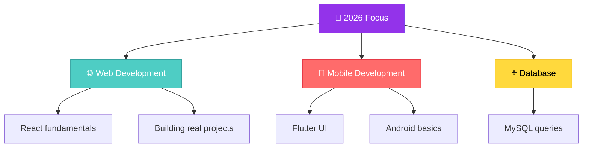

## 👩‍💻 About Me

[](https://user-images.githubusercontent.com/74038190/213910845-af37a709-8995-40d6-be59-724526e3c3d7.gif)

```ts
const sabbila: Student = {
  name: "Sabbila Rasyad",
  role: "Student / Aspiring Developer",
  location: "🇮🇩 Indonesia",
  status: "🎓 Looking for Internship (PKL) • Open to Part-time",

  currentlyLearning: [
    "🌐 Web Development (HTML, CSS, JS, React)",
    "📱 Mobile Development (Flutter, Android)",
    "🐍 Python basics",
    "🗄️ Database with MySQL",
  ],

  languages: {
    comfortable: ["HTML", "CSS", "JavaScript"],
    learning: ["Python", "React", "Flutter"],
  },

  tools: ["MySQL", "Android Studio", "Git", "Microsoft Office"],

  funFact: "Still figuring things out, one project at a time 🌱",
};
```

---

### 💻 Tech Stack

<p>


</p>

---

### 🗺️ Learning Roadmap



---

### 📊 GitHub Stats


---

### 📫 Connect With Me

[](https://user-images.githubusercontent.com/74038190/212284151-9d422739-96ba-472d-970e-9a7f5677a0a2.gif)

<a href="https://instagram.com/sabilllagi"></a>
<a href="mailto:rasyabilaa14@gmail.com"></a>

---

### 💭 Daily Inspiration

[](https://quotes-github-readme.vercel.app/api?type=horizontal&theme=tokyonight)

---

<div align="center">

**⭐️ From Sabbila Rasyad | Made with 💜 in Markdown**


</div>
